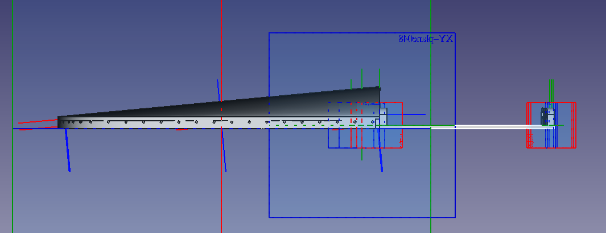

# bfo9000-ergonomic

An ergonomic palm rest and angled mount for the [BFO 9000 Keyboard](https://keeb.io/products/bfo-9000-keyboard-customizable-full-size-split-ortholinear)

Other parts used:
- [4mm Riser](https://www.digikey.co.nz/en/products/detail/w%C3%BCrth-elektronik/970200244/9488579)
- [12mm Riser](https://www.digikey.co.nz/en/products/detail/w%C3%BCrth-elektronik/970120244/9488556)
- [20mm Riser](https://www.digikey.co.nz/en/products/detail/w%C3%BCrth-elektronik/970200244/9488579)
- [Screw](https://nz.mouser.com/ProductDetail/144-50M020040H004)

The risers could be replaced by 3d printing that section instead, and then you could probably use the original screws that come with the BFO 9000.